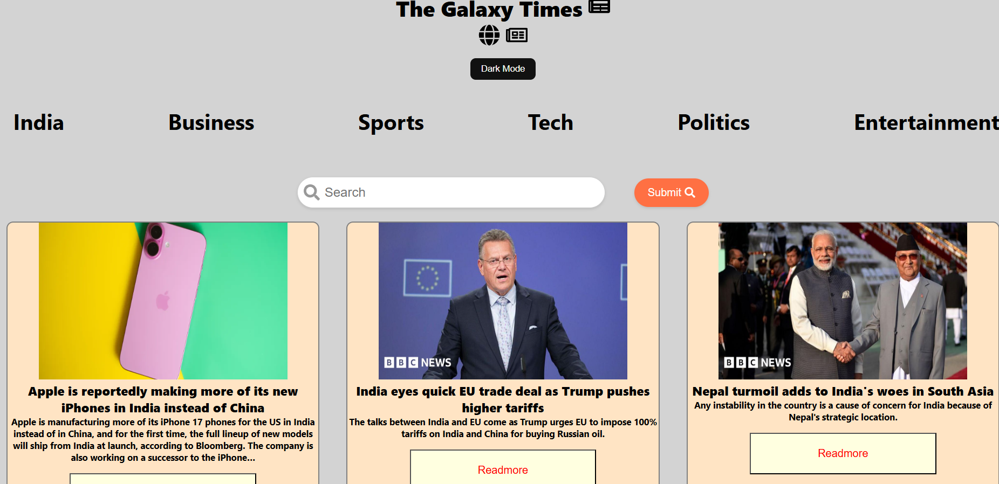

# 📰 NewspaperClone

  
  Newspaperclone

  A modern designed newspaper website clone   with  features like real-time news fetching, category-based filtering, search functionality, and even a news listening feature  making  its both useful and  engaging


## Demo - screenshots

 
 


## Features
- 🗞️ Real-time news fetching
- 🔍 Search functionality
- 🗂️ Category-wise filtering (e.g. Sports, Technology, Business)
- 🌙 Light/Dark mode toggle
- 🔊 Text-to-speech reading for each article
- ⚡ Fast and clean UI

## Tech stack
- **Frontend :**  React / HTML / CSS / react-icons
- **API:** [NewsAPI.org](https://newsapi.org)


## 💻 Installation

Follow these steps to run the project locally:


```bash
# Clone the repository

git clone https://github.com/HimanshuP13/Newspaperclone

```

# Navigate to the project directory
```bash
cd newspaperclone
```

# Install dependencies
```bash
npm install 
```

# Start the development server
```bash
npm start
```
## 🙋‍♂️ Author

**Himanshu P**  
[GitHub](https://github.com/HimanshuP13)


## 📄 License

This project is licensed under the [MIT License](LICENSE).
